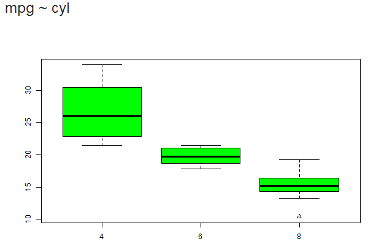

Best MPG
========================================================
author: C Bailey
date: 10 September 2016
autosize: true

Ever wonder how one might determine which car gets the best gas mileage?
========================================================

To demonstrate how, we

- explored the Motor Trend car road test data,
- determined which fields of data to focus on,
- wrote a shiny app to make use of the data, and
- developed this presentation to show it to you.

Exploring the data
========================================================

We used the Motor Trends road test data from 1974, which is a default data set in RStudio. Below are the available fields of data.


```r
head(mtcars)
```

```
                   mpg cyl disp  hp drat    wt  qsec vs am gear carb
Mazda RX4         21.0   6  160 110 3.90 2.620 16.46  0  1    4    4
Mazda RX4 Wag     21.0   6  160 110 3.90 2.875 17.02  0  1    4    4
Datsun 710        22.8   4  108  93 3.85 2.320 18.61  1  1    4    1
Hornet 4 Drive    21.4   6  258 110 3.08 3.215 19.44  1  0    3    1
Hornet Sportabout 18.7   8  360 175 3.15 3.440 17.02  0  0    3    2
Valiant           18.1   6  225 105 2.76 3.460 20.22  1  0    3    1
```

The Shiny App
========================================================

We wrote a Shiny app that let's one choose a parameter and return the average MPG's based on that parameter.

<!--html_preserve--><div class="container-fluid">
<div class="row">
<div class="col-sm-12">
<h1>Miles Per Gallon</h1>
</div>
</div>
<div class="row">
<div class="col-sm-4">
<form class="well">
<div class="form-group shiny-input-container">
<label class="control-label" for="variable">Variable:</label>
<div>
<select id="variable"><option value="cyl" selected>Cylinders</option>
<option value="am">Transmission</option>
<option value="gear">Gears</option></select>
<script type="application/json" data-for="variable" data-nonempty="">{}</script>
</div>
</div>
<div class="form-group shiny-input-container">
<div class="checkbox">
<label>
<input id="outliers" type="checkbox"/>
<span>Show outliers</span>
</label>
</div>
</div>
</form>
</div>
<div class="col-sm-8">
<h3>
<div id="caption" class="shiny-text-output"></div>
</h3>
<div id="mpgPlot" class="shiny-plot-output" style="width: 100% ; height: 400px"></div>
</div>
</div>
</div><!--/html_preserve-->

What you get!
========================================================

This is what the results look like. 

 

